# Memorable destinations

## Maldives

Maafushi Island in the Maldives offered a completely different world away from the hustle and bustle of big cities. It offered a unique experience in between the diverse marine life. During our visit, we explored the corals, encountered turtles, and even swam with sharks.

| :---:| :---: |
|  | 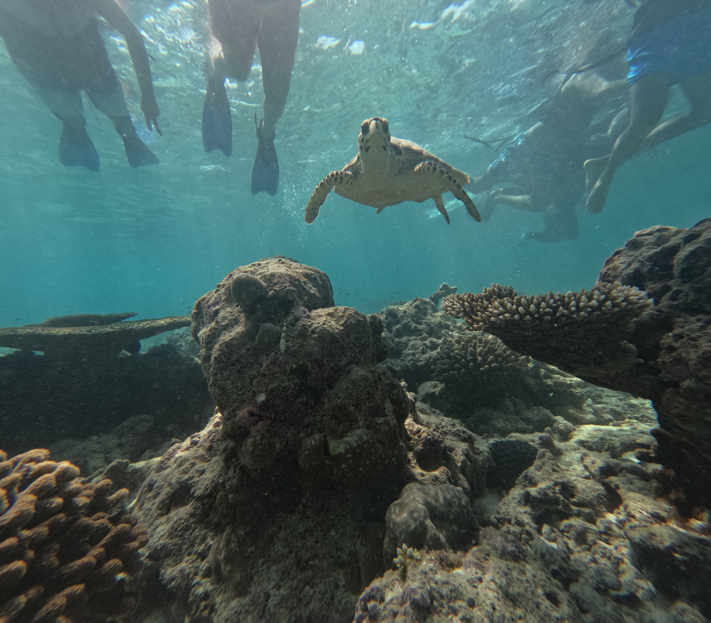  |
| 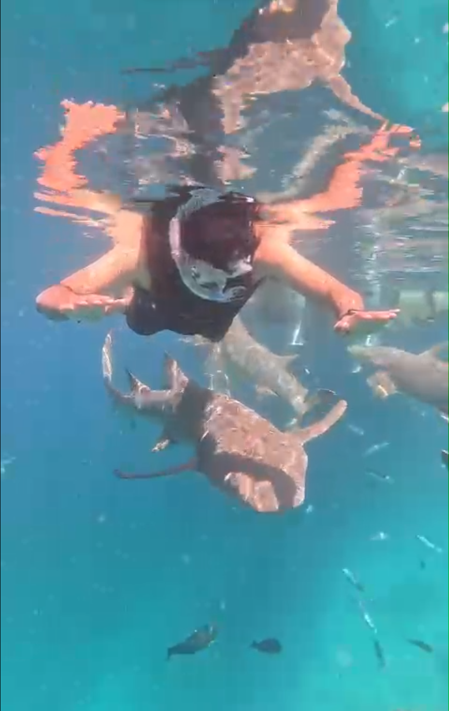 | 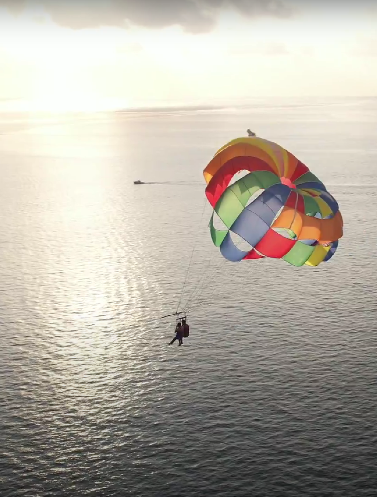 | 

## France
France had a lot to offer for everyone. The city of Lyon had beautiful cathedrals and beautiful landscapes; Annecy was a lucky find which had beautiful lakes, mountains and lovely weather which was both peaceful and happenning; Nice had blue water beaches with amazing restaurants and food. Paris was one place that we found overhyped and was a passable experience for me.

| :---:| :---: |
| 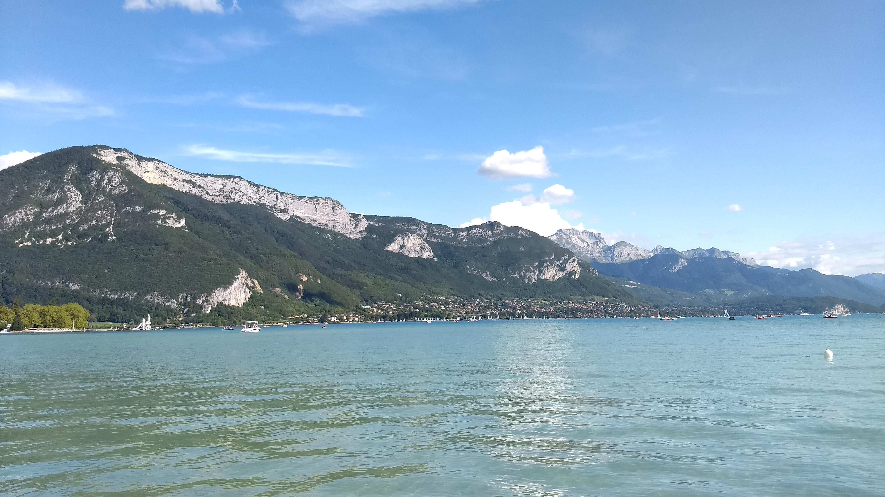 | 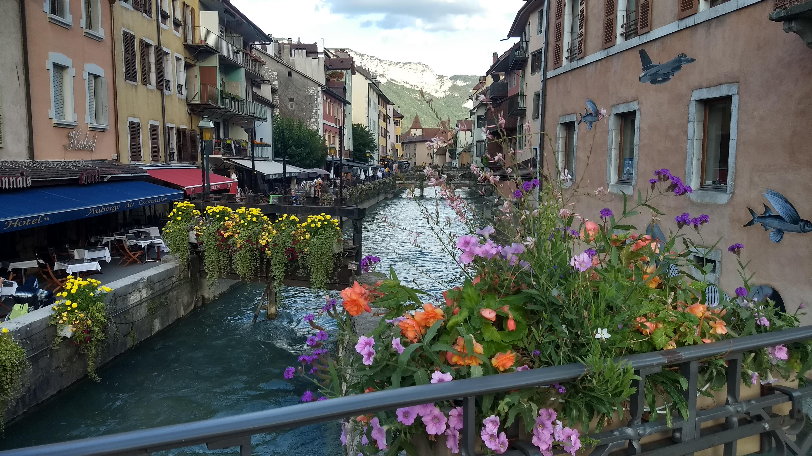 |
| 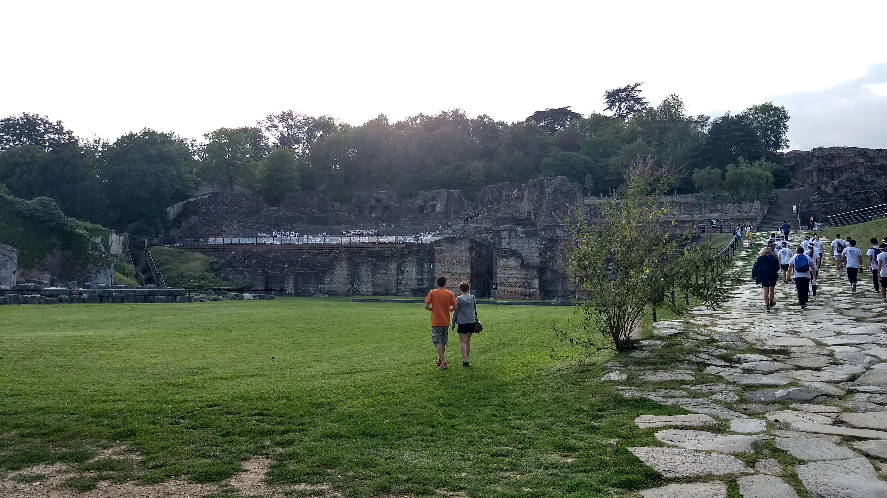 | 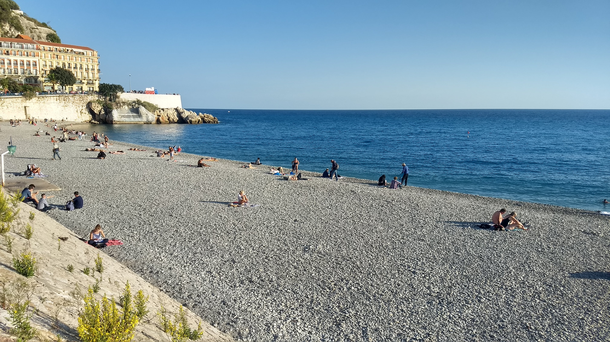 | 

## Switzerland
Switzerland was one of the most scenic country witht the majority of the country lying in the Alps mountain region. We travelled to the beautiful village of Lauterbrunnen which had no vehicles within the village and had clear spring water running along side the walking route. This village was our entry to the Jungfraujoch peak which is the highest point in Europe from the sea level. The journey to the top was via cable cars which was picturesque, exciting and scary as the cars often had to cross valleys at great heights. Cars stopped at different stations along the way to the top and each station had its own unique scenary. The first one had clear water and mountains, the second one offered a view of the greenary and a peak into the upcoming snowy mountains and the final one took us to the peak that was covered with snow, had skiing routes, hanging bridge and ice caves

| :---:| :---: |
| 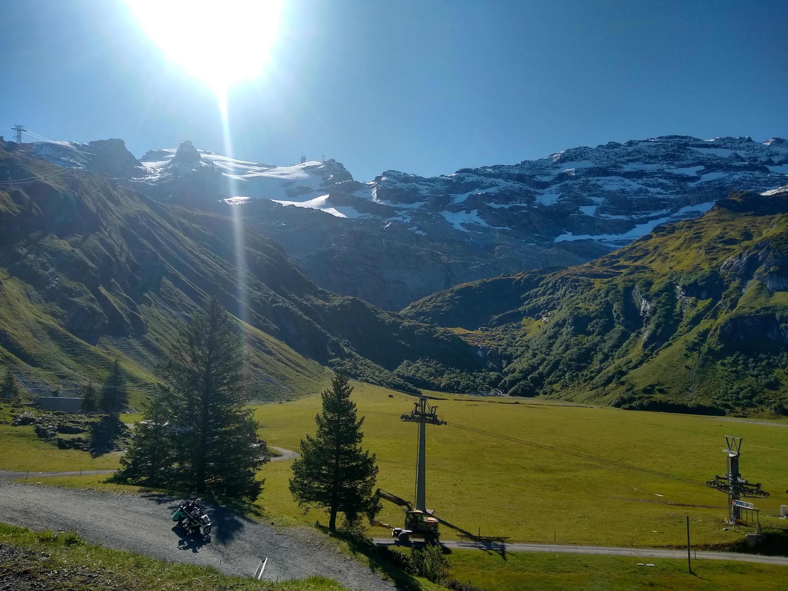 |  |
| 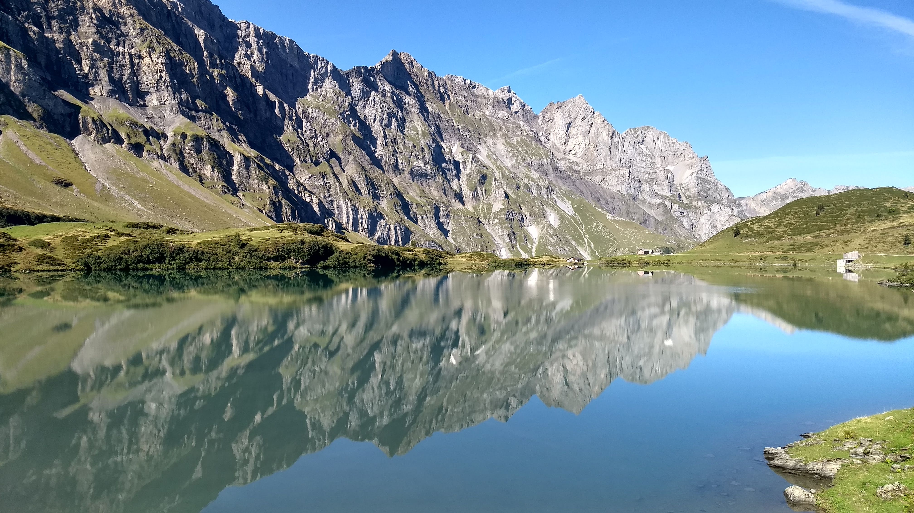 | 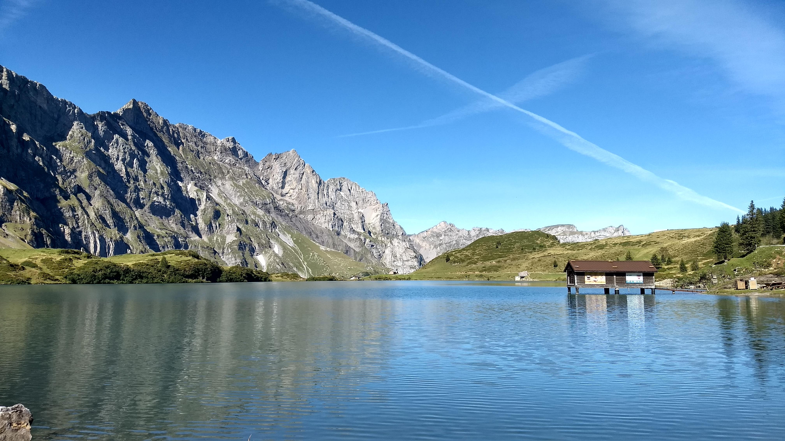 |

| :---:|
| 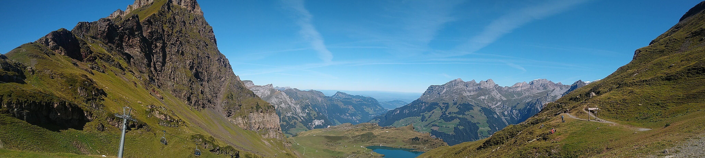 |

| :---:| :---: |
| 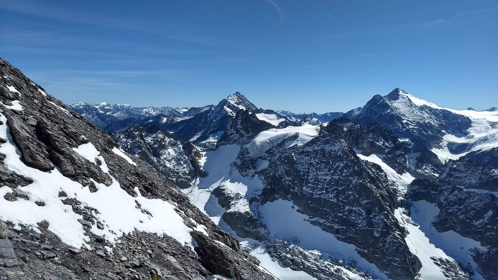 | 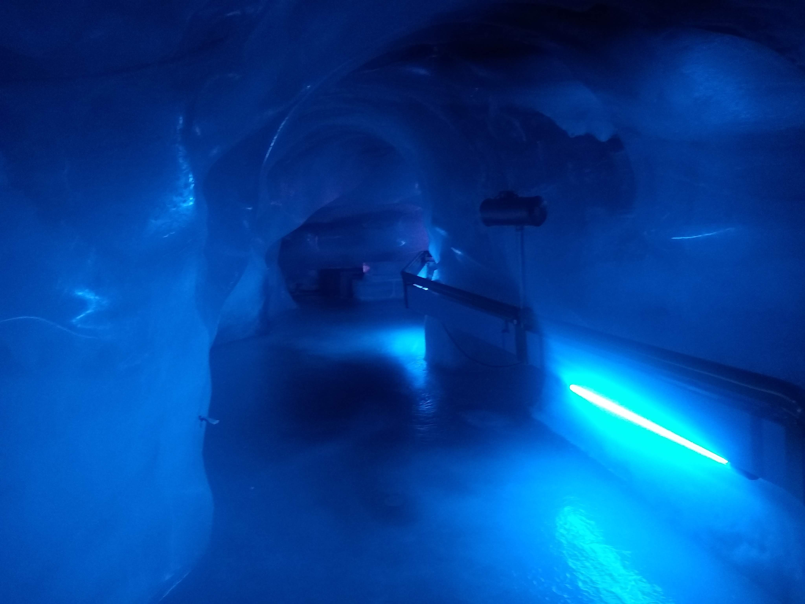 |

## Dubai

